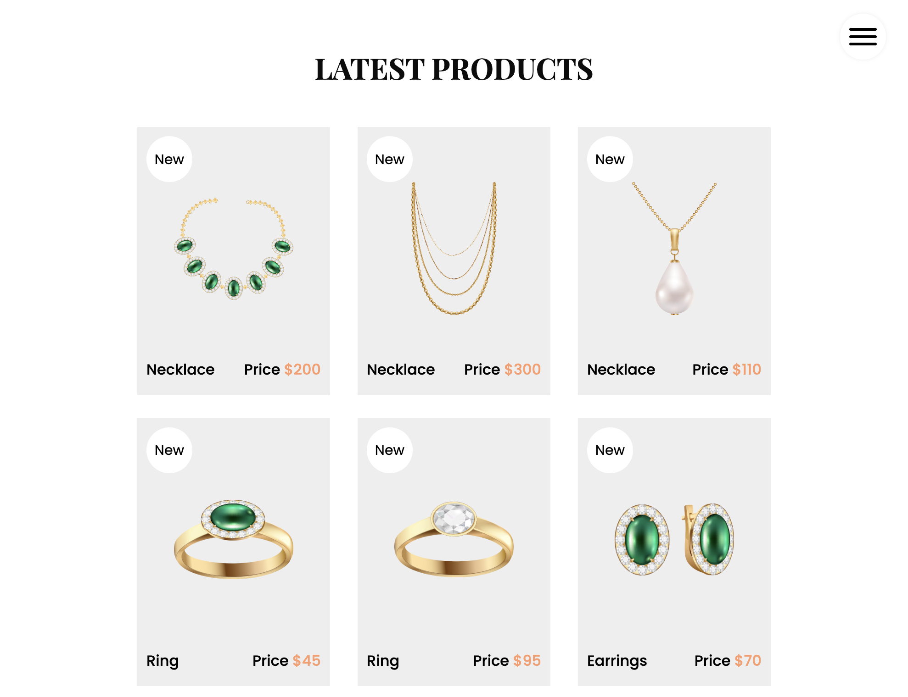

# The St.Paulia Project

## Description

This project is a web-page designed with the purpose of selling jewelry online and grow your bussiness. You can add a bit of your story, clients can review after buying something, add blogs with tips for your fashion clients and the most important, sell your full catalog. 

GitHub Repo: https://github.com/leogzz0/St.Paulia

## Table of Contents 

- [Installation](#installation)

- [Technologies Used](#technologies)

- [Usage](#usage)

- [License](#license)

- [Contributing](#contributing)

- [Test](#test)

- [Questions](#questions)

## Installation

Run on localhost

## Technologies 
- HTML
- CSS
- JavaScript
- Bootstrap
- SASS
- fontawesome

## Usage

This app can be used by any association who wants to have a bigger reach, faster their goals and have abetter interaction with their doners. For users this app can be used to find an association near you that better fit your need for what you want to donate.

This web-page can be used by any local bussiness who wants to have a bigger reach, faster their goals and have a better interaction with their clients. For users this web-page can be used to find new jewelry, buy a gifts and read blogs with fashion tips.

## License

This project is licensed under the MIT license

## Contributing

Contributors:
- leogzz0

## Test
To test this app:

run on localhost

## Questions

If you have any questions about the repository, open an issue or contact any of us contributors in https://github.com/leogzz0/St.Paulia
